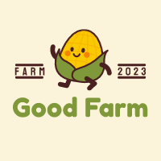

<h1 align="center">
	
	
 🐥 Uma fazenda do seu jeito 🐥 

</h1>

### 📌 Tecnologia utilizada para desenvolver o jogo:

Godot

### ⚙️ Versão do Godot utilizada:
Versão 4.1.1

## 📌 About
- O jogo tem como propósito exercitar a lógica através dos itens dispostos na fazenda, quando acertado as questões será liberado novas funcionalidades, quando errado a plantação será atacada por pragas. 

### 🍄 Configurações necessárias para o jogo rodar na Godot: 
#### 🥦 Alterações para ser realizadas no Godot para funcionamento do projeto: 🥦 

1. Window:  
1.1 Viewport Widht 320;
1.2 Viewport Height 180

1.3 Window Widht Override 1280
1.4 Window Height Override 720

#### 🌽 Inserir o script: 🌽
1. Selecionar o boneco character(nesse caso o nome é esse)
2. Ir em Node, canto inferior direito
3. Ir até a abinha Node
4. Script (nome do script.gd)

#### 🥕 Assets usados gratuitamente: https://gif-superretroworld.itch.io/farming-pack

#### 🧅 Slogan do jogo: https://pt.freelogodesign.org/manager
